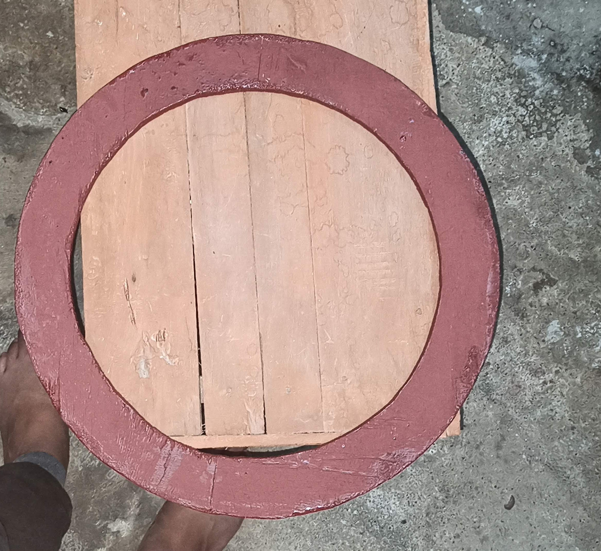

## Digital Clock

You can use the [URL](https://tripiyush.github.io/DIgitalCLock/) to maintain and preview the content for your website in Markdown files.

I am a backend Developer having 6+ years of experience. I am more interested in IOT based products . I Love to create application which are physical and we can control those things using apps/websites.I have created few of devices. Here is the explained Details of Digital Clock. 
This Device is WiFi controlled device using Touch swithes or Mobile Phones or even it can be controlled over alexa . 

### Requirements 

To create this device we need below things . 
- Hardwares

1. NodeMCU (ESP8266 12E)
2. Neopixel Led Strip
3. jumper wire
4. Soldring Iron
5. Touch Switch 

### Step- 1
 
 Cut Plywood based on your required size . 

### Step- 2 
Connect Touch Switch Pin with ESP8266.

### Step- 3
sticked NeoPixel Led Strip connected with Plywood design. 

### Step- 4 
Connect Touch Switch with ESP8266 and connect with NeoPixel LED Strip. 
and now we will start coding to create HTTP Server . 

